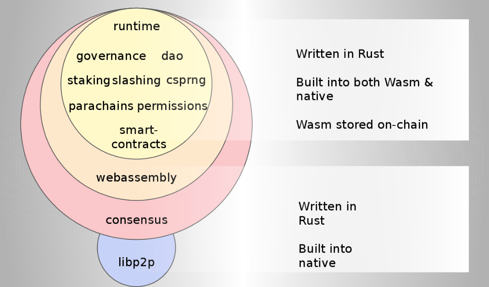
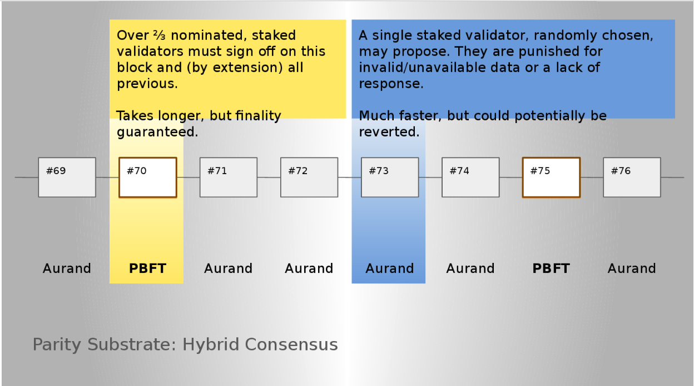
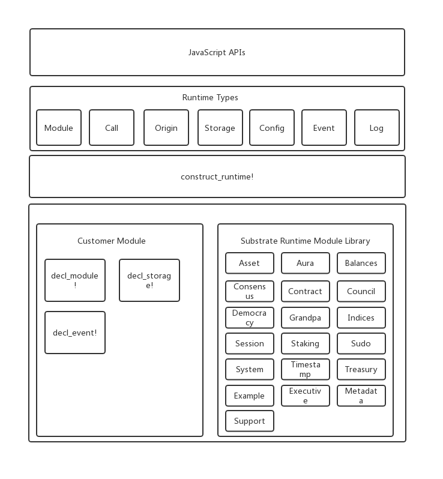
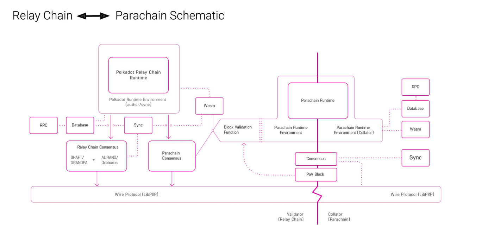
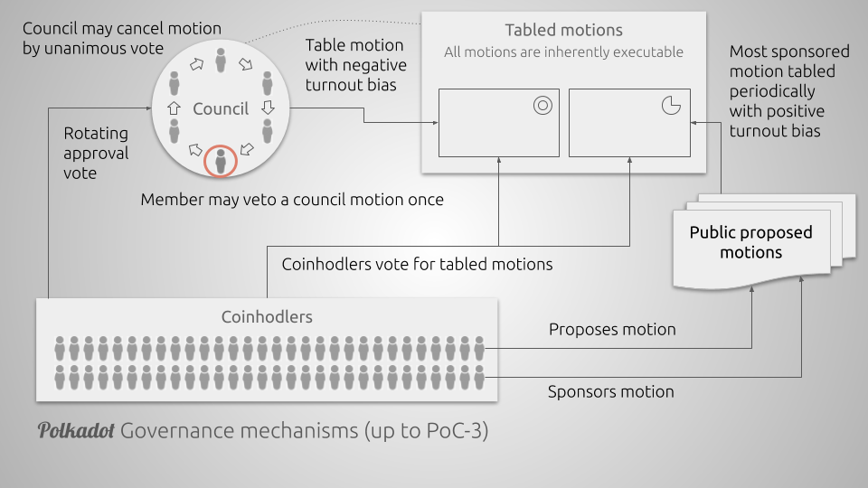

# Parity Substrate research

## 简介

Substrate 是 在Polkadot项目中抽象出来的区块链开发框架, 主要包含三个部分:

- core : 核心模块, 包含 网络, 共识, 存储 , rpc等
- srml: substrate runtime module library , runtime 的系统实现库,可以根据需要进行拼装
- node : 节点具体的运行逻辑部分


## Overview




runtime模块分为native和编译好的wasm文件, 节点在执行交易时会对比native 和wasm的执行结果,并以wasm(最新)的结果为准.


共识算法:




## Substrate 的用法

1. 使用默认的的node启动
2. 使用SRML组件定制化
3. 重新设计整个runtime

## Substrate 的核心数据类型

- Hash
- BlockNumber
- DigestItem
- Digest
- Header
- Extrinsic = Transactions or Inherents
- Block  =  Header + Extrinsics


## Substrate的代码结构

## 根级目录

- `ci` github 运行ci的脚本
- `core`**Substrate Core目录,**是该框架提供的核心功能
- `node` Substrate项目框架中自带的一个使用实例，**启动一条新链除Runtime部分之外可以直接把这里的代码拷贝过去**，同时也是熟悉框架的案例，调试框架的入口点。
- `node-template`一个更精简的`node`
- `scripts`一些项目构建脚本，一般情况下无需关心
- `srml` Substrate**默认提供的一些Runtime的模块**，其中在启动自己的链时**有一些Runtime模块是必须的，有一些模块可以不用**。但是要注意**模块之间是有依赖关系的**。
- `subkey`生成公私钥的小工具
- `test-utils` 测试工具集合

## `core`目录

- 共识相关组件
- - `basic-authorship` 提供进入共识模块的提议者`Proposer`的构建，可以理解为这个节点的出块者，将会作为参数传入共识组件中。
  - `consensus` Substrate提出的新共识的核心`aura`，事实上这个共识模块能够进行扩充，其首先定义了一些共识阶段所需要的基础接口，然后使用`aura`算法实现了这里的共识接口。**目前这部分比较耦合**，若想采用自己设计的共识可能需要考虑直接fork Substrate项目在这个目录下进行更改。
  - `finality-grandpa` 与`aura`配对的区块一致性认证，与`aura`联系紧密。若不采用`aura`算法则这部分可以舍弃。
- `cli` 命令行输入的解析。若需要添加自己的命令参考`node`里的`cli`进行构架，不需要更改这部分。
- `client` client 是节点的**存储**与当前运行**节点区块与状态**, 包含轻客户端和全客户端,可以理解为是一个节点启动后代表当前节点的实例。client实例将会传入到交易池，网络连接等组件中，整个程序运行周期中只有一个client。
- ```consensus```共识模块(aura and babe)
- `executor`执行器，包含了wasm的执行构建功能。
- ```finality-grandpa``` BFT 共识的实现
- `inherents` 内部交易的一些工具定义
- `keystore`与`keyring` 前者是提供公私钥工具，后者提供一些默认的私钥
- `network` 与 `network-libp2p` 底层网络设置，运用了著名的libp2p。
- `primitives` 原语定义。substrate 很多定义基础数据结构的命名都以 primitives 定义。这里需要注意这个目录定义的是`substrate-primitives` 后续还会出现 `runtime-primitives`。这里的primitives代表的是整个substrate的原语定义。
- `rpc` 与 `rpc-servers` rpc 与 **websocket** 的功能，另外指出，substrate提供的rpc只含的很原始的rpc接口，无法对原始数据做一定包装。今后的文章会剖析如何利用rpc完成自己的功能。
- `service` 链一些定义的数据结构 与 各项服务启动的入口。所有的服务线程（交易池，p2p，共识...）都是在这个模块中启动。
- `transaction-pool` 交易池。
- `trie` modified merkle patricia trie，MPT，“世界状态”。substrate在这一块沿用了以太坊的设计，不过在substrate里面只有状态树，即使是合约的功能也不专门存在合约的存储树。
- `state-db`与`state-machine` 前者包含状态数据库，且有**对状态进行裁剪的功能**，后者是“世界状态”的变化修改，与以太坊的模式类似。
- Runtime相关的定义。在 Substrate的发展中一开始命名为`Runtime`，后续命名为`Substrate Runtime`，故缩写为 `sr`，在代码中沿用之前的写法会出现 把 `sr`前缀 重命名为 `runtime`的情况。
- - `sr-std`，`sr-primitives`与`sr-io` 定义了 兼容 std/wasm 的std 库 ，在 runtime中使用的原语，能够允许std/wasm范围相同存储的io库。这里的`sr-primitives` 就是 `runtime-primitives` 。`substrate-primitives`是 `runtime-primitives` 的子集。
  - `sr-sandbox` 运用于 wasm 执行器的沙盒
  - `sr-api-macros`与`sr-version` 前者是提供Runtime的一些宏，后者是wasm与native执行时的版本判定的一些相关组件


## `srml` 目录

`srml`是Substrate默认提供的 `runtime module`。部分模块不可缺少，其他的可以根据自己需求使用。

首先列举核心的module

- `system`，`support` 与`metadata` 。这三个模块不可缺少的原因是它们负责了一些核心组件，并且部分被隐藏在`Runtime module` 定义一些结构的宏里。如果使用Substrate Runtime提供的工具，那么这些模块不可缺少。`system`用于和“区块”，“交易”相关，例如有一些Event定义，当前区块的hash，prev hash等等。`support`重点在于提供Runtime Module数据结构的宏的定义，提供了`decl_storage!`这个最关键的宏，这个模块很关键也很复杂，后续文章会进行讲解。`metadata`是用于导出Runtime Module的一些描述定义。
- `timestamp` 提供区块时间戳，runtime时间的模块。由于Substrate设计为Header里面不包含时间戳，而是使用一条交易包含时间，所以这个模块一般需要引入。
- `balance` 和`assets` 前者用于定义和资金相关的模块，后者定义类似token的相关模块。由于`balance`在很多地方都存在依赖关系，建议引入。
- `consensus`,`aura`和`grandpa` 共识相关模块，可以理解为可以反馈一些底层共识的信息与设置一些参数，提供内部交易等，不是共识算法的逻辑。
- `session`和 `staking` 定义区块的session间隔与权益相关的计算
- `council`，`democracy` ，`treasury`民主提议，财政等相关
- `sudo` sudo 权限，可以指定一个账户去执行 root 交易，后续文章会做介绍。
- `indices` 数字账户系统，相当于给公钥分配一个数字。
- `contract` 合约模块。这个模块与以太坊的智能合约功能近似。
- `example` 顾名思义，提供 Runtime Module 的编写示例。

总结`srml`：

如果考虑采用Substrate 提供的Runtime的工具集及它的模型，则需要引入一些必须的模块。若不使用，则需要构建许多Runtime Module 的基础工具集合且需要对整个框架有比较深入了解。而其他的模块可以根据自己链的需求进行选择。


## `node`目录

`node`是Substrate的一个示例。这里要首先指出，对于一条链而言，首先需要编译出Runtime的wasm代码，然后需要把wasm的执行文件一同编译进入节点，成为genesis中的数据。

- `cli` 针对 node的一些命令行，及**genesis的定义**
- `executor` 执行器的定义，注意这里需要读取wasm的执行文件并引入
- `primitives` node 的原语，进行了许多基础类型的定义。
- `runtime` 一条链的Runtime，在这个Runtime中引入了这条链需要的Runtime Module。注意这个模块下有`src`与`wasm`两个目录，其中Runtime的代码由`src`编译而来，而`wasm`使用`src`的代码编译出了wasm的执行文件。编译wasm需要切换到 `wasm`的路径下，并执行这个路径下的`build.sh`脚本。编译后会在`wasm/target/wasm32-unknown-unknown/release`目录下发现一个`node_runtime.compact.wasm`文件，这个文件就是Runtime的wasm执行文件。由于不同的机子编译出的wasm会在符号上有一些不一致，所以**注意这个文件需要进入git的管理** ，以防止由于需要引入wasm到genesis中导致生成的genesis不一致。


由于wasm代码的存在，可以保证即使节点没有更新到最新版本，仍然能够**以最新的代码运行**，保证不会因为代码的不同而分叉。同时在节点同步老数据的过程中也**不会因为本地代码是最新的而导致同步出错**。


## Runtime structure



## 创建Runtime

使用macro :  ```contract_runtime!```

```rust
construct_runtime!(
    pub enum Runtime with Log(InternalLog: DigestItem<Hash, Ed25519AuthorityId>) where
        Block = Block,
        NodeBlock = opaque::Block,
        UncheckedExtrinsic = UncheckedExtrinsic
    {
        System: system::{default, Log(ChangesTrieRoot)},
        Timestamp: timestamp::{Module, Call, Storage, Config<T>, Inherent},
        Consensus: consensus::{Module, Call, Storage, Config<T>, Log(AuthoritiesChange), Inherent},
        Aura: aura::{Module},
        Indices: indices,
        Balances: balances,
        Sudo: sudo,
    }
);
```

### Supported Types

The `construct_runtime!` macro provides support for the following types in a module:

- Module
- Call
- Storage
- Event or Event<T>
- Origin or Origin<T>
- Config or Config<T>
- Log
- Inherent

### 创建自定义module

运行时中的所有模块都需要Module类型。这种类型是通过decl_module!生成的宏。这是定义模块公开的所有公共函数的位置。

```rust
decl_module! {
    // Simple declaration of the `Module` type. Lets the macro know what its working on.
    pub struct Module<T: Trait> for enum Call where origin: T::Origin {
        fn deposit_event<T>() = default;

        fn sudo(origin, proposal: Box<T::Proposal>) {
            // This is a public call, so we ensure that the origin is some signed account.
            let sender = ensure_signed(origin)?;
            ensure!(sender == Self::key(), "only the current sudo key can sudo");

            let ok = proposal.dispatch(system::RawOrigin::Root.into()).is_ok();
            Self::deposit_event(RawEvent::Sudid(ok));
        }

        fn set_key(origin, new: <T::Lookup as StaticLookup>::Source) {
            // This is a public call, so we ensure that the origin is some signed account.
            let sender = ensure_signed(origin)?;
            ensure!(sender == Self::key(), "only the current sudo key can change the sudo key");
            let new = T::Lookup::lookup(new)?;

            Self::deposit_event(RawEvent::KeyChanged(Self::key()));
            <Key<T>>::put(new);
        }
    }
}
```

### Call

Call类型是decl_module!生成的枚举包含所有可调用函数及其参数的列表。

```rust
enum Call<T> {
    sudo(proposal: Box<T::Proposal>),
    set_key(new: <T::Lookup as StaticLookup>::Source),
}
```

### Storage

只要运行时使用decl_storage!就会暴露存储类型宏。此宏用于将运行时模块使用的数据保存到链状态。

```rust
decl_storage! {
    trait Store for Module<T: Trait> as Sudo {
        Key get(key) config(): T::AccountId;
    }
}
```

### Event

只要模块使用decl_event！模块存储事件，就需要公开事件类型。事件可用于轻松地将运行时中的更改或条件报告给外部实体，如用户，链资源管理器或dApp。

```rust
/// An event in this module.
decl_event!(
    pub enum Event<T> where AccountId = <T as system::Trait>::AccountId {
        /// A sudo just took place.
        Sudid(bool),
        /// The sudoer just switched identity; the old key is supplied.
        KeyChanged(AccountId),
    }
);
```

### Origin

只要模块声明要在模块中使用的自定义Origin枚举，就需要Origin类型。

对运行时的每个函数调用都有一个origin，它指定从哪里生成extrinsic。在签名的外部（事务）的情况下，源包含调用者的标识符。在固有外在的情况下，起源可以是空的。

每个对runtime的函数调用都有一个origin, 标明了 extrinsic的来源, 对于被签名的extrinsic (transaction), origin 包含了调用的identifier, 对应inherent extrinsic, origin为空


```rust
/// Origin for the council module.
#[derive(PartialEq, Eq, Clone)]
#[cfg_attr(feature = "std", derive(Debug))]
pub enum Origin {
    /// It has been condoned by a given number of council members.
    Members(u32),
}
```

### Config

只要模块在genesis配置中定义初始状态，就需要Config类型。默认情况下，所有存储变量都处于“未分配”状态，但在声明存储变量时使用config（）关键字可以初始化该状态。

```rust
GenesisConfig {
    ...
    sudo: Some(SudoConfig {
        key: root_key,
    }),
}
```

### Inherent

当模块定义ProvideInherent trait的实现时，需要Inherent类型。

只要您的模块想要提供inherent extrinsic 和/或 想要验证inherent extrinsic，就需要这种自定义实现。如果您的模块需要额外的数据来创建inherent extrinsic的外部数据，则需要将数据作为InherentData传递到runtime。


```rust
impl<T: Trait> ProvideInherent for Module<T> {
    type Inherent = T::Moment;
    type Call = Call<T>;

    fn create_inherent_extrinsics(data: Self::Inherent) -> Vec<(u32, Self::Call)> {
        let next_time = ::rstd::cmp::max(data, Self::now() + Self::block_period());
        vec![(T::TIMESTAMP_SET_POSITION, Call::set(next_time.into()))]
    }

    fn check_inherent<Block: BlockT, F: Fn(&Block::Extrinsic) -> Option<&Self::Call>>(
            block: &Block, data: Self::Inherent, extract_function: &F
    ) -> result::Result<(), CheckInherentError> {
        const MAX_TIMESTAMP_DRIFT: u64 = 60;

        let xt = block.extrinsics().get(T::TIMESTAMP_SET_POSITION as usize)
            .ok_or_else(|| CheckInherentError::Other("No valid timestamp inherent in block".into()))?;

        let t = match (xt.is_signed(), extract_function(&xt)) {
            (Some(false), Some(Call::set(ref t))) => t.clone(),
            _ => return Err(CheckInherentError::Other("No valid timestamp inherent in block".into())),
        }.into().as_();

        let minimum = (Self::now() + Self::block_period()).as_();
        if t > data.as_() + MAX_TIMESTAMP_DRIFT {
            Err(CheckInherentError::Other("Timestamp too far in future to accept".into()))
        } else if t < minimum {
            Err(CheckInherentError::ValidAtTimestamp(minimum))
        } else {
            Ok(())
        }
    }
}
```

## 自定义链

<https://substrate.dev/docs/en/tutorials/creating-your-first-substrate-chain>


# Polkadot



## Network structure

1. ParaChains
2. Relay Chain
3. Bridge Chains

## Network Roles

**validators**

验证器执行两个功能。首先，验证指定的一组子链块中包含的信息是有效的（例如交易方的身份和合约的主题）。第二个作用是参与共识机制，根据其他验证人的有效性声明生成中继链区块。任何不遵守共识算法的情况都会导致通过销毁部分或全部验证者的质押DOT而受到惩罚，从而阻止不良行为者。良好的表现将得到奖励，验证人以DOT的形式收取交易费用以换取他们的活动。

**collators**

Collators通过收集平行链的交易并为验证者生成状态转换证明来维护平行链。这些参与者在平行链上，并根据来自平行链的交易向验证人提供证据。 Collators通过将平行链事务聚合为平行链区块并根据这些块为验证者生成状态转换证明来维护平行链。 他们还监控网络并证明验证者的行为不良。 Collators维持特定平行链的“全节点”; 意味着他们保留所有必要的信息，以便能够创建新的块并执行交易，就像矿工在当前的PoW区块链上一样。 在正常情况下，他们将整理和执行交易以创建未密封的块，并将其与零知识证明一起提供给一个或多个负责提出平行链区块的验证器。

**Nominators**

作恶的validator可能导致提名者的DOT损失


## Cumulus

Cumulus是Substrate的扩展，可以轻松地将任何Substrate构建的运行时转换为与Polkadot兼容的parachain。

### Cumulus Consensus

是Substrate的共识引擎，它遵循Polkadot中继链。 在内部运行一个Polkadot节点，并指示客户端和同步算法链接跟随，最终确定和最佳处理。

### Cumulus Runtime

Substrate运行时的包装器，允许它们由Polkadot验证器验证并提供见证生成例程。 它将一个validate_block API添加到Substrate外部接口，该接口将由验证器调用。

将它集成到运行时,只需要导入包并将这一行宏添加到代码中。

```rust
runtime::register_validate_block!(Block, BlockExecutor);
```

### Bridges

polkadot 提供3种bridge

- *Bridge contracts* - Smart contracts deployed as bridges between Polkadot and external chains.
- *Cross-parachain communication* - No contracts needed.
- *In-built bridging modules* - Bridging to Polkadot from an external chain via a purpose-built module. (ChainX)

### Governance




### Parachain Slots

1、在链初始启动时，插槽数量较少，但会随着时间增加
2、通过拍卖的方式出租插槽，拍卖的方式是 Candle Auction
3、每次出租的插槽的生命周期是有限的
4、小部分插槽会由Web3基金会保留一部分时间，给“common good”的平行链


参与竞拍并非购买，只需抵押固定期限的DOT即可，本质上只是付出了通胀可能带来贬值的机会成本。当平行链插槽释放时，竞拍时抵押的DOT就可以获得返还。

出租周期被划分为【每6个月】，所有插槽的出租期同时开始和结束。
每次拍卖会包含4个出租周期，即2年时间。
需要租的项目可以根据自己的需要，自由的对这4个出租周期进行出价。
竞拍系统的机制是以两年为标准，最大化DOT的抵押数量。


### Interchain Message Passing (ICMP)

ICMP是一个事物队列, 基于Merkel tree 来保证其可信度, 中继链的验证器将一个平行链的输出队列的事物转移到目标平行链的输入队列

链间消息不会进入中继链。
链间消息将被限制为以字节为单位的最大大小。
允许子链阻止来自其他链的信息，在这种情况下，调度平行链会知道这个区块。
Collator节点负责在链之间路由消息。
Collators会生成一个“出口”消息列表，并会收到来自其他链接的“入口”消息。
在每个区块上，链条预计会从所有其他链中的某些子集路由消息。
当collator生成一个新块以交给验证器时，它将收集最新的入口队列信息并进行处理。
验证器将检查下一个parachain块的新候选者是否包括对该parachain的预期入口消息的处理的证据。


### SPREE

SPREE (Shared Protected Runtime Execution Enclaves), 也称为"trust wormholes," 允许平行链彼此信任,不管他们如何升级和发展

- Parachains可以选择加入特殊的运行时逻辑片段（如智能合约）
- Own storage, own ICMP endpoint
- 跨链的所有实例都具有相同的逻辑
- 与parachain一起执行
- 存储不能通过parachain逻辑改变; parachains不能伪造消息


## ChainX 

按资产种类分为两类：
1）PCX 节点（真实投票挖矿节点）
2）跨链资产节点（如 BTC，Sdot）也叫虚拟挖矿节点

按职能分为三类：
1）信托节点（托管只能单向relay的数字资产托管安全业务）
2）验证节点（正常出块，确认块，维护 ChainX 网络的安全和稳定）
3)  同步节点  (接收和广播网络信息，为各类链外应用提供服务)

按状态分为三类：
1）验证节点（参与共识，出块并对块进行确认）
2）候选节点（即将成为验证节点的候选人）
3）退选节点（主动退出或者被强制惩罚退出，不再参与网络贡献和接收网络收益）

ChainX 将会是目前最大的 PoS 共识网络，申请成为 ChainX 节点几乎零门槛，只要能够支付注册节点的手续费。 而申请成为信托节点，则有一定门槛，需要行业资历背书和社区审查。

PCX 节点有三个收益来源：
1， 投票用户投票收益的 10% 。
2， 用户充值或者绑定推荐人奖励，也就是充值用户虚拟挖矿收益的 10%。
3， 验证节点打包交易所有手续费的 10%。

信托节点有两个好处：
1， 议会收益的 20%。
2， ChainX 钱包将会对信托节点进行置顶展示，获得更大的曝光度。

